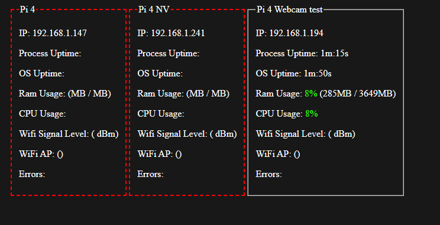

# Raspberry Pi Roamer Camera
This project was an attempt to create a camera that we could strap to actors, and broadcast it over the internal network.

- [Raspberry Pi Roamer Camera](#raspberry-pi-roamer-camera)
  - [Streaming Video](#streaming-video)
  - [Streaming Audio](#streaming-audio)
  - [Monitoring the Pi](#monitoring-the-pi)
  - [Startup Script](#startup-script)

## Streaming Video
For streaming video, I went with a generic install of [UV4L](https://www.linux-projects.org/uv4l/), with [this config file](.repo/configs/uv4l-raspicam.conf)

Here were the exact camera settings we used for our application:


We could then access our stream using this URL:
```http
http://IP OF PI:8080/stream/video.mjpeg
```

## Streaming Audio
Now for the audio streaming: I could not find a better way to do this, and the video and audio were not sync'd. We did not continue this project enough to inject time code.

I ended up using VLC media player:

```bash
cvlc -vvv alsa://plughw:2 --sout '#transcode{acodec=mp3,ab=64,channels=1}:standard{access=http,dst=0.0.0.0:8888/out.mp3}' --sout-mux-caching 100 --network-caching 100
```

Then, we can access our MP3 stream via OBS or VLC:
```http
http://IP OF PI:8888/out.mp3
```

## Monitoring the Pi

[This is a NodeJS application](./CameraServer/) I wrote to be able to monitor the PI. You can access the JSON for this page at: 
```http
http://IP OF PI:1337/status
```

```json
{
  "procUptime": 177551,
  "osUptime": 212410,
  "tempature": {
    "c": 33.6,
    "f": 92.48
  },
  "throttledError": [/*A list of error messages will be here*/],
  "ram": {
    "total": 3649,
    "free": 3358,
    "cached": 20,
    "used": 291,
    "percentUsed": 8
  },
  "cpu": {
    "total": 84704,
    "active": 8111,
    "idle": 76593,
    "percentUsed": 34
  },
  "wifi": {
    "error": "/*An error message will be here if wifi fails to init*/",
    "signalLevel": {
        "percent": 100,
        "dBm": -35
    }
  }
}
```

Error messages:
*   Under-voltage!
*   ARM frequency capped!
*   Currently throttled!
*   Soft temperature limit active.
*   Under-voltage has occurred since last reboot.
*   Throttling has occurred since last reboot.
*   ARM frequency capped has occurred since last reboot.
*   Soft temperature limit has occurred.

I wrote a simpleish HTML page to display these stats. You can find it [here](./monitor/index.html)



## Startup Script
I created a small startup script that is executed when the PI boots up. You can find it [here](./.repo/scripts/startup-script.sh)